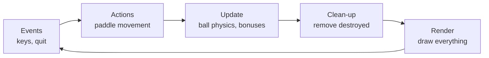

# 🕹 ARKANOID in Python

### How I built and extended a classic arcade game with pygame

<div class="pt-12">
  <span class="blink">▶ PRESS SPACE TO START</span>
</div>

<div class="pt-4 opacity-60 text-sm">
  Navigate with <kbd>space</kbd> or <kbd>→</kbd>
</div>

<div class="abs-br m-6 text-sm opacity-50">
  Sarvarchik · 2026
</div>

---
hideInToc: true
---

# 📋 Contents

<div class="text-left">
  <Toc columns="2" maxDepth="1" />
</div>

<div class="pt-8">
  <Link to="11" class="nav-btn">🎮 Impatient? Jump straight to the demo</Link>
</div>

---

# About the project

<div class="grid grid-cols-2 gap-6 items-center">
<div class="text-left">

- 🐍 **Python 3.11** + **pygame 2.6.1**
- 📦 ~870 lines of code
- 🧱 Levels defined in plain text files
- 🎁 7 kinds of power-ups
- 🔊 Sound, particles, ball trail
- 📂 Code on GitHub: <a href="https://github.com/Sarvarchik2/python-game" target="_blank">Sarvarchik2/python-game</a>

</div>
<div>
  
</div>
</div>

---

# Anatomy of the game

<v-clicks>

- 🏓 **Paddle** — the player, moves with ← → arrow keys
- ⚪ **Ball** — flies on its own, bounces off everything
- 🧱 **Bricks** — take 1–2 hits, some are indestructible
- 🎁 **Power-ups** — drop from destroyed bricks with a 30% chance
- 🔫 **Laser** — shoots if you catch the L power-up
- 📊 **HUD** — score and lives at the top of the screen
- 🧊 **Boundaries** — walls built from indestructible bricks

</v-clicks>

---

# Architecture: who is responsible for what

```text
arkanoid_pygame/
├── main.py            ← entry point, screen switching
├── settings.py        ← ALL constants in one place
├── game/
│   ├── entities.py    ← Paddle, Ball, Brick, Bonus, LaserBullet
│   ├── level.py       ← level parser for .txt files
│   ├── particles.py   ← particle burst when a brick explodes
│   └── audio.py       ← sounds and music
├── screens/
│   ├── menu.py        ← main menu
│   ├── game_screen.py ← all the gameplay logic
│   └── ...            ← settings, win, game over
└── levels/level1.txt  ← a level as plain text
```

<v-click>

💡 The rule: **logic, settings and screens live separately** —
any game value can be tweaked in a single file, `settings.py`.

</v-click>

---

# The game loop: the heart of every game

A game is a loop that runs **60 times per second**:



<v-click>

```python
while True:                      # the main loop
    for event in pygame.event.get(): ...   # events
    paddle.move(keys)                      # actions
    score += _update_balls(...)            # update
    _draw_frame(screen, ...)               # render
    clock.tick(cfg.FPS)                    # exactly 60 FPS
```

</v-click>

---

# The hardest part: bounce physics

Which side of the brick did the ball hit? Find the **smallest overlap**:

```python {all|1-5|7|8-10|11-13|all}
overlap_left = ball.rect.right - rect.left      # intrusion from the left
overlap_right = rect.right - ball.rect.left     # intrusion from the right
overlap_top = ball.rect.bottom - rect.top       # intrusion from the top
overlap_bottom = rect.bottom - ball.rect.top    # intrusion from the bottom

min_overlap = min(overlap_left, overlap_right, overlap_top, overlap_bottom)

if min_overlap == overlap_top and ball.vy > 0:
    ball.rect.bottom = rect.top   # snap to the edge
    ball.vy *= -1                 # reflect the velocity
elif min_overlap == overlap_left and ball.vx > 0:
    ball.rect.right = rect.left
    ball.vx *= -1
# ... same for bottom and right
```

<v-click>

⚠️ Always check the **direction** of the velocity — otherwise the ball gets stuck inside the brick.

</v-click>

---

# Levels are plain text files

<div class="grid grid-cols-2 gap-8">
<div>

**levels/level1.txt:**

```text
0 . 0
1 1 1 1 1 1 1 1 1 1 1 1
. 2 2 2 . . 2 2 2 . 2 2
1 1 . 1 1 . 1 1 . 1 1 .
```

- `1`, `2` — brick durability
- `0` — indestructible
- `.` — empty space

</div>
<div>

**The parser — just a few lines:**

```python
for r, line in enumerate(lines):
    for c, token in enumerate(line.split()):
        if token == '.':
            continue
        if token.isdigit():
            bricks.append(Brick(c, r, int(token)))
```

<v-click>

💡 A new level = a new .txt file.
Anyone can design levels, even without knowing Python!

</v-click>

</div>
</div>

---

# Power-ups: all 7 of them

| | Letter | Type | Effect |
|---|---|---|---|
| <span class="chip" style="--c:#00ff00"></span> | **E** | extend | paddle ×2 wider |
| <span class="chip" style="--c:#ff00ff"></span> | **M** | multiball | +1 ball |
| <span class="chip" style="--c:#ffff00"></span> | **L** | laser | shoot with spacebar |
| <span class="chip" style="--c:#00ffff"></span> | **1** | extra_life | +1 life |
| <span class="chip" style="--c:#ff0000"></span> | **S** | shrink | narrower paddle — **mine** |
| <span class="chip" style="--c:#ffa500"></span> | **+** | speed_up | faster ball — **mine** |
| <span class="chip" style="--c:#ffffff"></span> | **−** | speed_down | slower ball — **mine** |

<v-click>

The last three are my homework 👇

</v-click>

---

# My homework: 3 new power-ups

<div class="grid grid-cols-2 gap-6">
<div>

**Slowing the ball down:**

```python
def speed_down(self) -> None:
    if abs(self.vx) > cfg.MIN_BALL_SPEED:
        self.vx -= 1 if self.vx > 0 else -1
    if abs(self.vy) > cfg.MIN_BALL_SPEED:
        self.vy -= 1 if self.vy > 0 else -1
```

</div>
<div v-click>

**What this small feature taught me:**

- ⚠️ the ball must **never stop** → a minimum speed limit
- ⚠️ the sign of velocity = direction → change only the magnitude
- ⚠️ the paddle must not "teleport" when shrinking → keep its center

</div>
</div>

<v-click>

🎯 The main lesson: even a "simple" feature drags edge cases along with it.

</v-click>

---
layout: center
---

# 🎮 Demo: play right inside the slide!

<MiniArkanoid />

<div class="text-sm opacity-60 pt-2">
  The same gameplay, rewritten in JavaScript + canvas for this presentation
</div>

---

# What I learned

<v-clicks>

- 🎮 **The game loop** — how 60 frames per second become a game
- 📐 **Collisions** — AABB overlaps, bounces, edge cases
- 🏗 **Architecture** — separating settings, logic and rendering
- 🗂 **Git** — branches, commits, working with someone else's repo
- 🐍 **Deeper Python** — type hints, classes, modules and packages
- 🤝 **Working with AI** — how to give it tasks and verify the results

</v-clicks>

---

# Tools

<div class="grid grid-cols-3 gap-4 pt-8">
<div class="p-4 rounded tool-card">

### 🐍 Code

- Python 3.11
- pygame 2.6.1
- VS Code

</div>
<div class="p-4 rounded tool-card">

### 🔧 Process

- Git + GitHub
- venv
- ruff / pylint

</div>
<div class="p-4 rounded tool-card">

### 🤖 AI

- Claude Code — helped with code and this presentation
- Slidev — slides from markdown

</div>
</div>

<v-click>

<div class="pt-8 opacity-80">
Honestly: AI helped me understand and verify things, but I ran and tested every power-up myself 🙂
</div>

</v-click>

---
layout: center
class: text-center final-slide
hideInToc: true
---

# Thank you! 🎉

### Questions?

<div class="pt-8">
  <a href="https://github.com/Sarvarchik2/python-game" target="_blank" class="nav-btn">📂 Game code on GitHub</a>
</div>

<div class="pt-6 opacity-50 text-sm">
  Slides: Slidev · the mini-game on slide 11 is playable 😉
</div>
